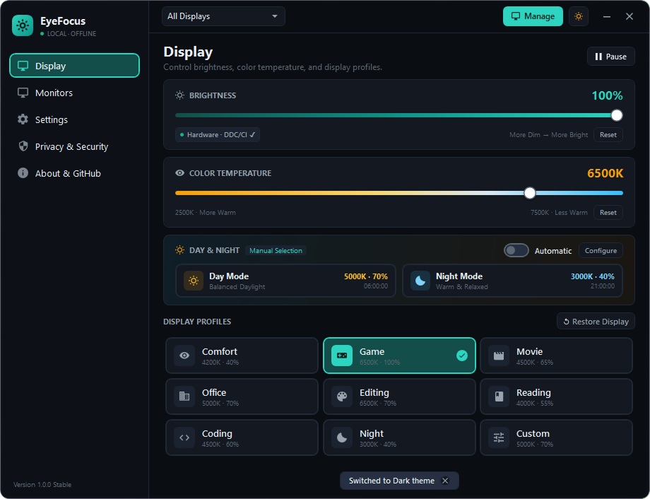
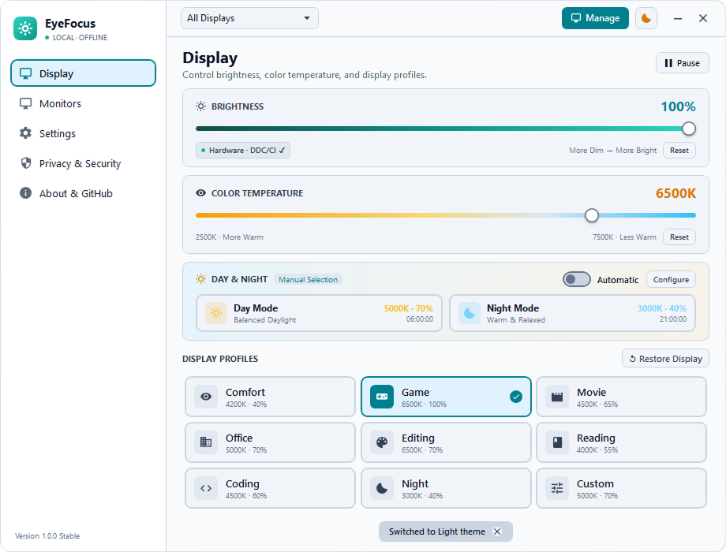
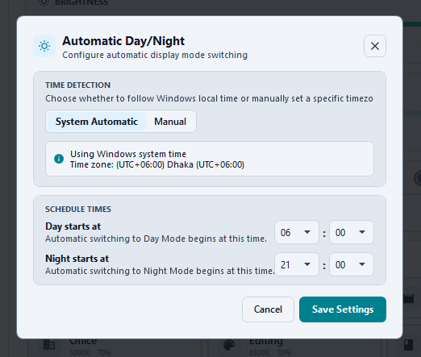
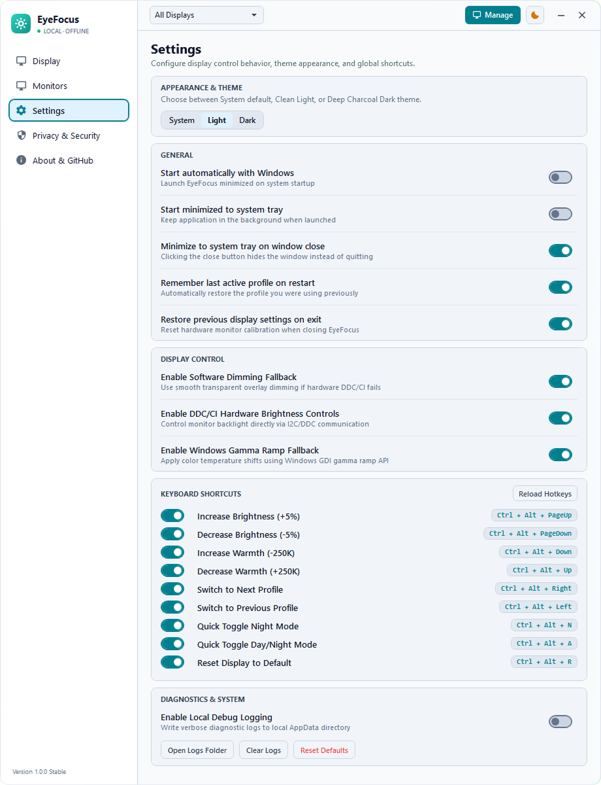
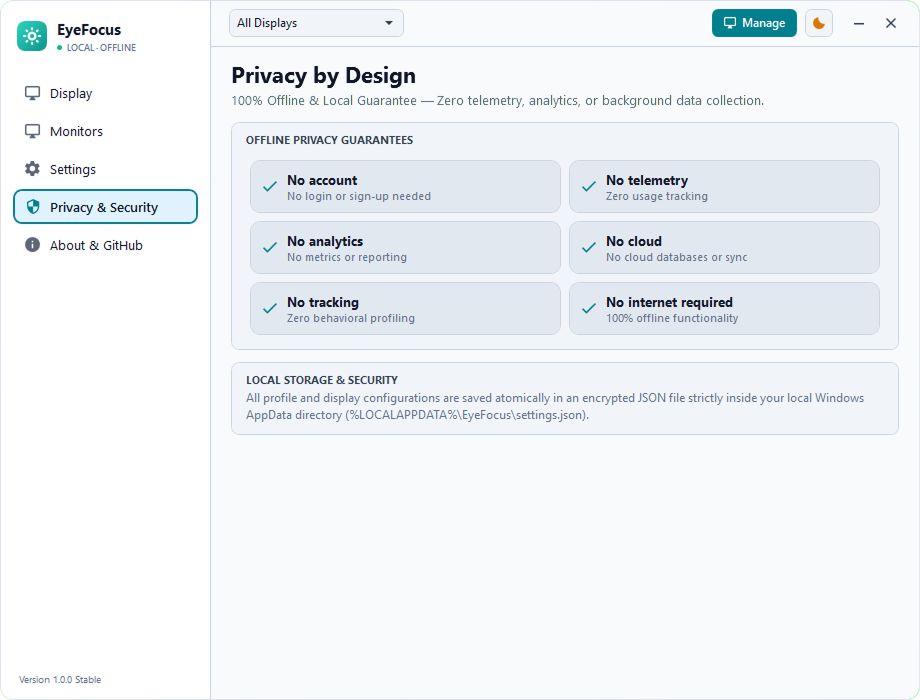

# EyeFocus

<div align="center">


### Modern, Privacy-First Windows Display Comfort & Eye-Care Utility


[](https://github.com/mahfujkn/EyeFocus/releases)

[**Download Portable (.ZIP)**](https://github.com/mahfujkn/EyeFocus/releases) • [**Features**](#-features) • [**Installation**](#-installation--usage-guide) • [**Screenshots**](#-screenshots) • [**Tech Stack**](#️-technology-stack)
</div>

---

## 📖 Overview

**EyeFocus** is a modern, privacy-first, lightweight Windows desktop utility engineered to protect your vision, reduce eye strain, and optimize display comfort throughout the day and night.

Designed with clean **Material Design 3 Expressive & Fluent UI** aesthetics, EyeFocus gives you direct, frictionless hardware and software control over monitor brightness, correlated color temperature (CCT), and tailored lighting presets — completely offline with zero telemetry, analytics, or background data collection.

---

## ✨ Features

- ☀️ **Real Hardware DDC/CI & Software Dimming Engine**:
  - Direct hardware monitor backlight adjustment via I2C/DDC communication.
  - Smooth transparent full-screen overlay dimming fallback when hardware controls are unavailable.
  - Safe, flicker-free Windows GDI Gamma Ramp color temperature shifts.
- 🌡️ **Wide Kelvin Color Temperature Tuning (2500K – 7500K)**:
  - Custom Correlated Color Temperature (CCT) curve ranging from ultra-warm amber (2500K) to cool daylight (7500K).
  - Fine-grained 50K increments with one-click profile reset.
- ⏰ **Automated Day & Night Intelligent Scheduling**:
  - Smooth, periodic automated transitions between daytime neutral lighting and relaxed nighttime warm lighting.
  - Fully customizable transition windows, day/night target kelvins, and brightness levels.
- 🎛️ **8 Curated Lighting & Workflow Presets**:
  - **Comfort** (4200K / 40%): Balanced blue-light filtration for daily extended computer usage.
  - **Game** (6500K / 100%): Full vibrancy and high-refresh color accuracy.
  - **Movie** (4500K / 65%): Cinematic warm contrast for media consumption.
  - **Office** (5000K / 70%): Clear, neutral daylight lighting for productive focus.
  - **Editing** (6500K / 70%): Color-accurate studio calibration.
  - **Reading** (4000K / 55%): Gentle warm paper-like tone for long reading sessions.
  - **Coding** (4500K / 60%): High contrast with eye strain reduction for IDEs.
  - **Night** (3000K / 40%): Melatonin-preserving deep warm glow for late-night sessions.
- 🖥️ **Multi-Monitor Discovery & Independent Control**:
  - Automatically identifies all connected displays and GPU adapters with real-time capability probing.
  - Supports individual per-monitor adjustments and simultaneous multi-display synchronization.
- 🔒 **100% Offline & Zero-Telemetry Privacy Guarantee**:
  - Zero internet access required. No analytics, tracking, or network sockets.
  - Local atomic JSON storage strictly within Windows AppData.
- 🎨 **Adaptive Dynamic Theming**:
  - Deep Glassmorphism Dark Mode and High-Contrast Clean Light Mode.
  - Follows Windows System theme automatically or allows manual lock.
- ⌨️ **Global Keyboard Shortcuts & System Tray Integration**:
  - Instant brightness and warmth adjustments from anywhere in Windows via customizable global hotkeys.
  - Lightweight background system tray operation with quick right-click actions.

---

## 📸 Screenshots

<div align="center">

### 1. Display Dashboard (Dark Mode)



---

### 2. Display Dashboard (Light Mode)



---

### 3. Automatic Day & Night Schedule Configuration



---

### 4. Application Settings & Preferences (Light Mode)



---

### 5. Privacy by Design Guarantees (Light Mode)



</div>

---

## 🚀 Installation & Usage Guide

### Method 1: Download Portable Release ZIP (Quickest & Easiest)

1. Go to the official [**GitHub Releases Page**](https://github.com/mahfujkn/EyeFocus/releases).
2. Download the latest **`EyeFocus-v1.0.0-Windows-Portable.zip`** release archive.
3. Extract the ZIP archive anywhere on your PC (e.g., `C:\EyeFocus` or Desktop).
4. Double-click **`EyeFocus.exe`** to launch the application.
5. 🎉 **EyeFocus** runs instantly as a standalone portable app — no installer, admin rights, or registry clutter required!

---

### Method 2: Build From Source (.NET 8 SDK)

1. **Clone the repository**

   ```bash
   git clone https://github.com/mahfujkn/EyeFocus.git
   cd EyeFocus
   ```

2. **Run Unit Tests**

   ```bash
   dotnet test EyeFocus.Tests/EyeFocus.Tests.csproj -c Release
   ```

3. **Publish Standalone Portable Application**

   ```bash
   dotnet publish EyeFocus/EyeFocus.csproj -c Release -r win-x64 --self-contained false -o Publish/Portable
   ```

4. **Launch Application**

   ```bash
   .\Publish\Portable\EyeFocus.exe
   ```

---

## 🛠️ Technology Stack

| Component | Technology |
| :--- | :--- |
| **Application Framework** | Windows Presentation Foundation (WPF) / .NET 8.0 Windows SDK |
| **Architecture Pattern** | MVVM (Model-View-ViewModel) with Clean Reactive Separation |
| **Display Communication** | Windows DDC/CI (VCP Codes `0x10`, `0x12`), Win32 GDI `SetDeviceGammaRamp`, Direct3D Layer |
| **Multi-Monitor Management** | Windows SetupAPI, Win32 `EnumDisplayMonitors`, WMI `WmiMonitorBrightness` |
| **Design System** | Google Material Design 3 Expressive & Windows 11 Fluent UI Glassmorphism |
| **Quality & Tests** | xUnit Test Suite with Full Headless Service Mocking (43/43 Passing Tests) |

---

## 👨‍💻 Author & Developer

Developed with ❤️ by **[Mahfuj Khan Rafsan](https://zaap.bio/mahfuj)**

---

## 📄 License

This project is distributed under the **MIT License** — see [`LICENSE`](LICENSE) for more information.
